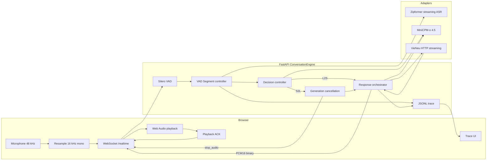
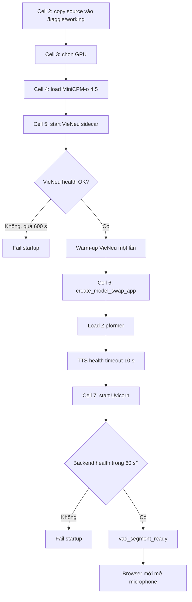
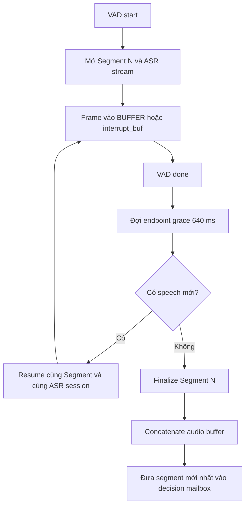
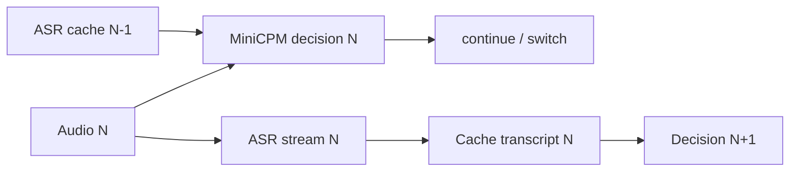
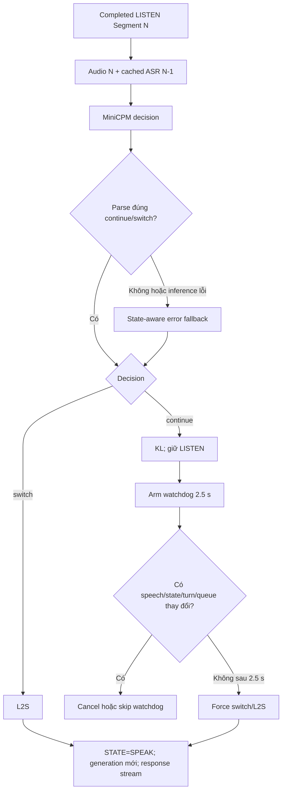
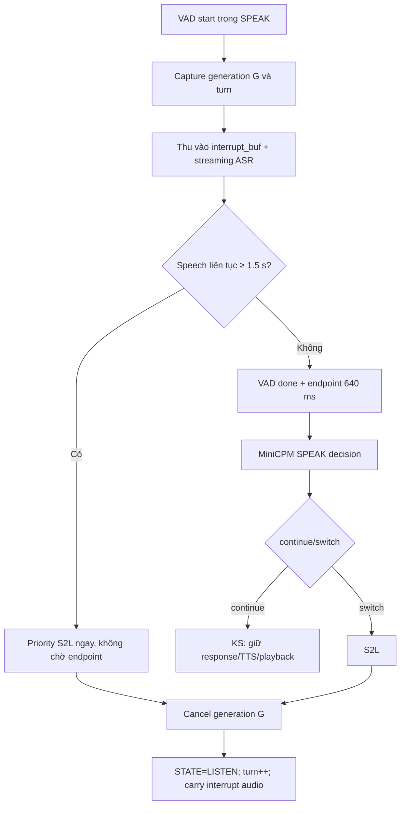
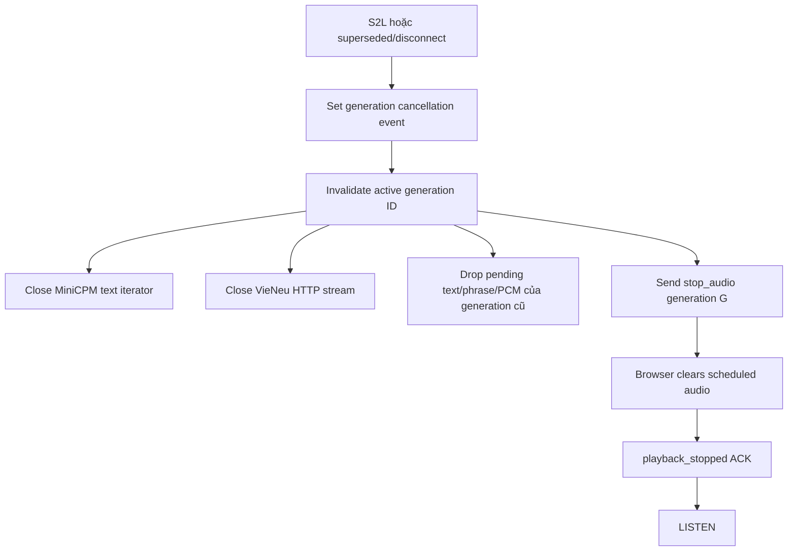
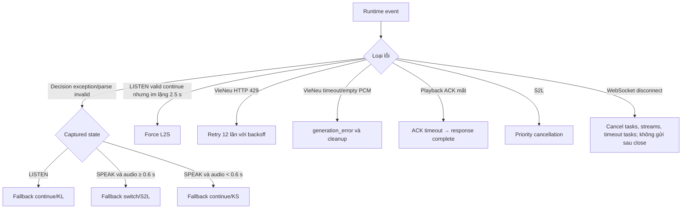
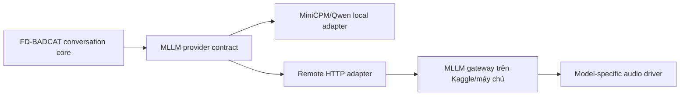

# FD-BADCAT Model Swap — Architecture and Processing Flow

Tài liệu này mô tả kiến trúc **đang hoạt động** của worktree `fd-badcat-model-swap` khi chạy bằng `kaggle.ipynb`.

Sơ đồ Draw.io tương ứng: [fabadcat_adapter.drawio](./fabadcat_adapter.drawio).

> Trạng thái cấu hình chính: `DUPLEX_MODE=vad_segment`, `MLLM_LIVE_PREFILL=0`, `MLLM_WARMUP_DUPLEX_WRAPPER=0`. Hệ thống dùng VAD Segment, Zipformer streaming ASR theo từng segment, MiniCPM decision và response là hai request riêng, VieNeu HTTP streaming theo phrase. Native `model.as_duplex()` không nằm trên active path.

## 1. Mục tiêu và phạm vi

Pipeline thực hiện hội thoại giọng nói gần full-duplex:

- Microphone luôn có thể tiếp tục gửi audio khi trợ lý đang phát tiếng.
- Backend có hai trạng thái điều khiển chính: `LISTEN` và `SPEAK`.
- MiniCPM chỉ trả `continue` hoặc `switch` cho decision request.
- Backend ánh xạ decision sang bốn cờ điều khiển:

| Backend state | MiniCPM decision | Control flag | Hành động |
|---|---|---|---|
| `LISTEN` | `continue` | `KL` | Keep Listen |
| `LISTEN` | `switch` | `L2S` | Listen-to-Speak, bắt đầu response |
| `SPEAK` | `continue` | `KS` | Keep Speak |
| `SPEAK` | `switch` | `S2L` | Speak-to-Listen, hủy response hiện tại |

Decision và response không nằm trong cùng một chuỗi token. Response là một text stream riêng sau khi backend nhận `L2S`.

## 2. Tổng quan triển khai



### 2.1 Phân bổ GPU trên Kaggle

| Thiết bị vật lý | Thành phần |
|---|---|
| Tesla T4 GPU 0, khoảng 14.56 GiB | Zipformer ASR `cuda:0`; một phần MiniCPM |
| Tesla T4 GPU 1, khoảng 14.56 GiB | VieNeu TTS `cuda:1`; phần còn lại của MiniCPM |

Notebook hiện đặt giới hạn bộ nhớ MiniCPM xấp xỉ:

- GPU 0: `13 GiB`.
- GPU 1: `10 GiB`.

Do MiniCPM được shard trên cả hai GPU trong khi VieNeu dùng GPU 1, decision/response MiniCPM và TTS có thể cạnh tranh tài nguyên GPU 1.

### 2.2 Thành phần mã nguồn

| File | Trách nhiệm |
|---|---|
| `src/model_swap.py` | Khởi tạo provider, đọc env, load ASR, health/warm-up TTS, gắn trạng thái vào app |
| `src/backend.py` | WebSocket, VAD Segment, state machine, decision, response, cancellation, playback ACK, tracing |
| `src/model_providers/zipformer.py` | Zipformer streaming session |
| `src/model_providers/minicpmo.py` | MiniCPM decision, response stream, inference ownership và cooperative cancellation |
| `src/model_providers/vieneu.py` | VieNeu health, warm-up và HTTP PCM stream |
| `src/text_segmenter.py` | `HybridPhraseChunker` |
| `src/web/app.js` | Microphone, WebSocket, PCM scheduling, `stop_audio`, playback ACK và UI trace |

## 3. Startup và warm-up



### 3.1 Thời gian warm-up

Không gán một con số cố định cho thời gian warm-up model vì giá trị phụ thuộc Kaggle session, cache Hugging Face, CUDA initialization và tải GPU.

| Hạng mục | Thời điểm | Cách ghi nhận |
|---|---|---|
| MiniCPM load | Cell 4, một lần sau kernel restart | Thời gian động; không tính vào per-turn TTFA |
| Zipformer load | Cell 6/app factory | Thời gian động; không tính vào per-turn TTFA |
| VieNeu warm-up | Cell 5, sau khi sidecar healthy | Đọc hết PCM probe; đo `probe_elapsed` và byte count |
| Native duplex wrapper | Không chạy | `MLLM_WARMUP_DUPLEX_WRAPPER=0`; active path không gọi `model.as_duplex()` |

VieNeu warm-up sử dụng câu mặc định:

```text
Xin chào, hệ thống đã sẵn sàng.
```

Sau warm-up thành công, notebook đặt:

```text
TTS_WARMUP_COMPLETED=1
TTS_WARMUP_SECONDS=<thời gian đo thực tế>
TTS_WARMUP_BYTES=<số byte PCM thực tế>
```

App factory nhận biết warm-up đã chạy ở notebook và chỉ ghi lại số đo vào `app.state`, không synthesize lại lần nữa.

### 3.2 Timeout startup

| Hoạt động | Timeout/deadline |
|---|---:|
| Chờ VieNeu sidecar khởi động | 600 s |
| VieNeu health GET trong vòng lặp startup | 3 s/request |
| VieNeu `/v1/voices` | 10 s |
| VieNeu warm-up HTTP connect | 10 s |
| VieNeu warm-up HTTP read | 120 s |
| App factory TTS health | 10 s |
| Chờ backend Uvicorn | 60 s |
| Backend thread join khi shutdown | 15 s |
| VieNeu terminate wait | 15 s |
| VieNeu kill wait sau terminate timeout | 5 s |

## 4. Audio input, VAD và VAD Segment

### 4.1 Frame input

1. Browser thu microphone ở sample rate thiết bị, thường là `48 kHz`.
2. AudioWorklet resample thành float mono `16 kHz`.
3. Browser gửi frame `256 samples`, tương đương `16 ms`, qua WebSocket binary.
4. Backend ghép hai frame trước khi gọi Silero:

```text
2 × 256 samples = 512 samples = 32 ms ở 16 kHz
```

Ghép hai frame vì Silero streaming path dùng cửa sổ 512 samples tại 16 kHz. Đây không phải Unit một giây.

### 4.2 Hai buffer theo state

| State khi `vad_start` | Buffer | Ý nghĩa |
|---|---|---|
| `LISTEN` | `BUFFER` | Audio lượt người dùng bình thường |
| `SPEAK` | `interrupt_buf` | Audio có khả năng là echo, backchannel hoặc barge-in |

Backend chụp lại tại `vad_start`:

- State quan sát được.
- Turn hiện hành.
- Generation hiện hành nếu đang `SPEAK`.
- Segment ID.

Snapshot này giữ đúng ngữ nghĩa của audio tại thời điểm thu, kể cả khi worker xử lý muộn và state tổng thể đã đổi.

### 4.3 Endpoint logic



`VAD_SEGMENT_ENDPOINT_MS=640` cho phép ghép các khoảng ngừng ngắn vào cùng một phát ngôn. Hệ quả là hai ý nói cách nhau dưới 640 ms có thể bị ghép thành một Segment.

## 5. Zipformer streaming ASR

ASR không còn chạy file-based theo Unit một giây. Với mỗi VAD Segment:

```text
VAD start
  → open_stream() một lần
  → audio frame liên tục → accept_waveform()
  → partial transcript liên tục
VAD endpoint
  → tail padding
  → final transcript
  → đóng session
```

Thông số hiện tại:

| Thông số | Giá trị |
|---|---:|
| Sample rate | 16 kHz |
| `ASR_CHUNK_SIZE` | 32 |
| `ASR_LEFT_CONTEXT` | 128 |
| `ASR_TAIL_PADDING_MS` | 660 ms |
| Search | Greedy |
| Execution provider | CUDA |
| Physical GPU | GPU 0 |

ASR partial/final được trace nhưng decision N không chờ current transcript N để tránh tăng latency.

## 6. Decision context và thứ tự thời gian

Decision N nhận:

```text
Current audio Segment N
Cached ASR transcript của Segment N-1
State instruction LISTEN hoặc SPEAK
```

Transcript Segment N chỉ được cache sau khi hoàn tất và có hiệu lực từ Segment N+1.



Điều này bảo đảm decision không bị chặn bởi ASR hiện tại, nhưng có một giới hạn: nếu MiniCPM nghe audio yếu và ASR N có transcript tốt, transcript đó vẫn không thể cứu chính decision N.

### 6.1 Decision mailbox: latest wins

Decision queue có `maxsize=1`.

- Chỉ giữ một VAD Segment chưa được worker lấy xử lý.
- Nếu có Segment mới hơn trong khi một Segment cũ vẫn đang pending, Segment mới thay thế Segment pending cũ.
- Inference đang chạy trong CUDA kernel không bị preempt tức thời.
- Mục tiêu là barge-in mới không phải xếp sau hàng loạt Unit cũ.

## 7. Luồng LISTEN



### 7.1 Fallback khi classifier lỗi

Fallback này chỉ chạy khi:

- MiniCPM inference phát sinh exception; hoặc
- Output không parse được thành `continue`/`switch`.

Trong `LISTEN`, fallback bảo thủ trả `continue`.

Một output hợp lệ nhưng sai về ngữ nghĩa, ví dụ MiniCPM trả `continue` cho một câu đã hoàn chỉnh, không bị nhánh error fallback ghi đè.

### 7.2 Fallback chống treo LISTEN 2.5 giây

Sau một decision hợp lệ `continue → KL`, backend arm watchdog:

```text
VAD_LISTEN_CONTINUE_TIMEOUT_SECONDS=2.5
```

Sau 2.5 giây, backend force `switch → L2S` nếu tất cả guard vẫn đúng:

- Cùng watchdog epoch/index.
- Cùng turn.
- Không có speech mới.
- Effective state vẫn là `LISTEN`.
- Decision mailbox đang rỗng.
- Không có Segment mới thay thế.

Nếu có `vad_start` mới, watchdog cũ bị hủy để người dùng được nói tiếp. Fallback này không gọi classifier lần hai.

Trace source:

```text
decision_source=upstream_continue_timeout
fallback_reason=listen_continue_timeout
```

## 8. Luồng SPEAK và barge-in

VAD vẫn chạy trong `SPEAK`. Mục đích là phát hiện người dùng chen ngang trong lúc trợ lý phát audio.



### 8.1 Long-interrupt threshold

```text
VAD_LONG_INTERRUPT_SECONDS=1.5
```

Threshold được tính theo speech liên tục trong lúc VAD đang active. `audio_seconds` của Segment finalized có thể chứa pre-roll và endpoint silence, vì vậy `audio_seconds > 1.5` không tự động có nghĩa long-interrupt đã đạt 1.5 giây.

### 8.2 SPEAK error fallback

Khi decision inference/parse lỗi:

| Điều kiện | Fallback |
|---|---|
| Đã được đánh dấu `long_interrupt` | `switch → S2L` |
| SPEAK segment có audio ít nhất 0.6 s | `switch → S2L` |
| SPEAK segment ngắn hơn 0.6 s | `continue → KS` |

`0.6 s` chỉ là fallback khi classifier lỗi. Nếu MiniCPM trả hợp lệ `continue`, backend hiện không dùng rule 0.6 s để ghi đè kết quả đó.

### 8.3 Echo và backchannel

Trong `SPEAK`, `continue → KS` được dùng cho:

- Silence/noise bị VAD kích hoạt nhầm.
- Tiếng trợ lý vọng lại microphone.
- Backchannel ngắn như “ừ”, “vâng”, “okay”.

Nếu không có acoustic echo cancellation hoặc người dùng không dùng tai nghe, TTS playback có thể liên tục kích hoạt VAD. Dù classifier trả `KS` đúng, mỗi Segment vẫn tiêu tốn một MiniCPM decision và có thể làm chậm response.

## 9. Response text streaming và HybridPhraseChunker

Sau `L2S`:

1. Backend tạo generation ID mới.
2. `STATE` chuyển sang `SPEAK`.
3. MiniCPM nhận response request riêng.
4. Text delta được đẩy qua delta queue.
5. `HybridPhraseChunker` ghép delta thành phrase an toàn.
6. Phrase vào queue TTS.
7. VieNeu trả PCM từng chunk.
8. Backend gửi PCM binary ngay cho browser.

### 9.1 Hybrid phrase parameters

| Thông số | Giá trị |
|---|---:|
| Minimum phrase | 20 ký tự |
| First target | 48 ký tự |
| Later target | 72 ký tự |
| Maximum phrase | 140 ký tự |
| First phrase timeout | 350 ms |
| Later phrase timeout | 500 ms |

Thứ tự ưu tiên điểm cắt:

1. Dấu kết câu mạnh: `.`, `!`, `?`, `…`, `。`, `！`, `？`, newline.
2. Dấu mềm: dấu phẩy, chấm phẩy, dấu hai chấm.
3. Word boundary.

Timeout không cắt giữa một từ. Nếu đến timeout mà chưa có điểm cắt an toàn, chunker giữ buffer và arm timeout mới.

### 9.2 Queue response

| Queue | Kích thước | Vai trò |
|---|---:|---|
| MiniCPM delta queue | 32 | Backpressure giữa native text iterator và chunker |
| TTS phrase queue | 2 | Không cho MiniCPM chạy quá xa trước VieNeu |

`tts_phrase_ready` được trace trước `await phrase_queue.put()`. Vì vậy event có `tts_text_queue_depth=2` nghĩa là producer sắp bị block do queue đầy nếu consumer chưa lấy phrase.

## 10. VieNeu HTTP PCM streaming

Mỗi phrase tạo một request riêng tới VieNeu:

```text
POST /v1/audio/speech
  → HTTP chunked response
  → PCM16 mono 16 kHz
  → iter_content 4096 bytes/chunk
```

Adapter hiện không dùng một WebSocket/gRPC session persistent cho nhiều phrase.

| Thông số | Giá trị |
|---|---:|
| Max concurrent TTS streams | 1 |
| TTS connect timeout | 10 s |
| TTS read/provider timeout | 120 s |
| HTTP 429 retries | 12 |
| Initial busy backoff | 0.25 s |
| Maximum busy backoff | 2 s |

Backoff tăng theo cấp số nhân và bị giới hạn ở 2 giây.

### 10.1 TTFA

Khi nhận PCM đầu tiên, backend phát event:

```text
tts_first_audio
metric=backend_first_pcm
warmup_included=false
```

```text
TTFA = timestamp(first PCM at backend) - timestamp(response_started)
```

Đây chưa phải thời điểm người dùng thực sự nghe âm thanh; browser playback ACK cung cấp mốc playback thực tế.

## 11. Browser playback ACK và state reconciliation

Browser gửi các ACK bất đồng bộ:

```text
playback_scheduled
playback_started
playback_drained
playback_stopped
```

Backend là nguồn quyết định semantic state. Frontend không được tự ghi đè `LISTEN/SPEAK`.

ACK chỉ cung cấp sự thật transport/playback:

- PCM đã được schedule chưa.
- Thiết bị đã bắt đầu phát chưa.
- Buffer đã phát hết chưa.
- Audio đã bị dừng do cancellation chưa.

Backend coi effective state là `SPEAK` nếu:

```text
STATE == SPEAK
hoặc
browser playback của generation hiện hành chưa DRAINED/STOPPED
```

Sau khi server gửi xong PCM, backend chờ playback drain. Deadline:

```text
remaining_audio_duration + PLAYBACK_ACK_GRACE_SECONDS
PLAYBACK_ACK_GRACE_SECONDS = 2.0
```

Nếu không có ACK đúng hạn, backend phát `playback_ack_timeout`, dọn playback state và hoàn thành response theo timeout path.

## 12. Cancellation khi S2L



Mọi delta, phrase, PCM và playback ACK mang generation ID. Event thuộc generation cũ bị bỏ sau khi generation hiện hành thay đổi.

### 12.1 Giới hạn cancellation

- Transformers cancellation là cooperative tại ranh giới text chunk.
- Backend không thể preempt tức thời một CUDA kernel đang chạy.
- Đóng VieNeu HTTP request ngay, nhưng việc GPU sidecar dừng compute tức thời phụ thuộc server có xử lý client disconnect hay không.
- Cleanup WebSocket phải tránh gửi `generation_cancel_requested`, `stop_audio` hoặc `playback_ack_timeout` sau khi socket đã đóng.

## 13. Tổng hợp queue và concurrency

| Thành phần | Chính sách/kích thước | Khi đầy hoặc bận |
|---|---|---|
| Decision mailbox | `maxsize=1`, latest wins | Segment pending cũ bị thay bởi Segment mới |
| Zipformer frame input | Persistent per Segment | Queue depth được trace; cần giữ gần 0–2 |
| MiniCPM inference lock | Một inference critical section | Decision có ưu tiên hơn response chunk |
| MiniCPM streaming owner | Một response stream owner | Ngăn nhiều stream MiniCPM cùng dùng session |
| Delta queue | `maxsize=32` | Text iterator bị backpressure |
| Phrase queue | `maxsize=2` | Response producer bị block |
| VieNeu semaphore | `1` | Phrase request chờ; HTTP 429 có retry/backoff |

Decision được ưu tiên hơn response text decoding. Nếu microphone liên tục kích hoạt VAD vì echo, nhiều decision request có thể làm response chậm đáng kể dù tất cả đều trả `KS`.

## 14. Bảng timeout và threshold runtime

| Cấu hình | Giá trị | Phạm vi |
|---|---:|---|
| `VAD_SEGMENT_ENDPOINT_MS` | 640 ms | Ghép khoảng ngừng ngắn trước khi finalize Segment |
| `VAD_LONG_INTERRUPT_SECONDS` | 1.5 s | Priority S2L khi speech liên tục trong SPEAK |
| `VAD_SPEAK_FALLBACK_SWITCH_SECONDS` | 0.6 s | Chỉ dùng khi SPEAK classifier inference/parse lỗi |
| `VAD_LISTEN_CONTINUE_TIMEOUT_SECONDS` | 2.5 s | Force L2S sau KL nếu mọi guard vẫn đúng |
| First phrase timeout | 350 ms | Flush phrase đầu tại safe boundary |
| Later phrase timeout | 500 ms | Flush các phrase tiếp theo |
| TTS connect timeout | 10 s | Thiết lập HTTP request |
| TTS read timeout | 120 s | Đọc PCM response |
| Playback ACK grace | 2.0 s | Cộng vào remaining audio duration |
| TTS health timeout | 10 s | App factory startup |
| VieNeu startup deadline | 600 s | Notebook Cell 5 |
| Backend startup deadline | 60 s | Notebook Cell 7 |

## 15. Tracing và UI

Mỗi WebSocket session có một file JSONL:

```text
/kaggle/working/fd-badcat-traces/trace-<timestamp>-<trace_id>.jsonl
schema=fd-badcat.trace.v1
```

Các trường correlation chính:

- `trace_id`.
- `turn`.
- `segment`.
- `generation`.
- `state` và `captured_state`.
- `decision`, `decision_source`, `flag`.
- Queue depth.
- ASR partial/final.
- TTS phrase/segment lifecycle.
- Playback ACK lifecycle.
- Cancellation request/finished.

Các mốc latency quan trọng:

| Metric | Bắt đầu | Kết thúc |
|---|---|---|
| VAD endpoint latency | `vad_done` | `vad_segment_finalized` |
| Decision latency | Decision worker start | `vad_segment_tick` |
| L2S-to-first-text | `response_started` | First `assistant_delta` |
| Backend TTFA | `response_started` | `tts_first_audio` |
| Playback start latency | `response_started` | `playback_started` ACK |
| Cancellation latency | `generation_cancel_requested` | `generation_cancel_finished`/`playback_stopped` |

Trace không lưu raw audio hoặc base64 audio. Khi `TRACE_INCLUDE_TEXT=1`, transcript và response text vẫn được lưu và phải được xem là dữ liệu có thể nhạy cảm.

## 16. Nhánh lỗi và fallback tổng hợp



## 17. Known limitations của active architecture

1. Native `MiniCPM model.as_duplex()` không chạy.
2. Không có unified token stream chứa cả control flag và response.
3. Decision và response là hai request MiniCPM riêng.
4. Decision N chưa dùng current ASR transcript N.
5. Không có persistent VieNeu WebSocket/gRPC session cho nhiều phrase.
6. MiniCPM shard dùng GPU 1 cùng VieNeu, có khả năng tranh chấp VRAM/compute.
7. Không có acoustic echo cancellation hoặc speaker verification CAM++ trên active path.
8. Valid classifier false-negative không bị state fallback 0.6 s ghi đè; LISTEN được cứu bởi watchdog 2.5 s, SPEAK phụ thuộc long-interrupt hoặc decision kế tiếp.
9. Cancellation MiniCPM/VieNeu không bảo đảm dừng GPU kernel tức thời.
10. Smoke test phải mô phỏng playback ACK hoặc backend phải cleanup an toàn khi client kết thúc ngay sau `tts_stream_end`.

## 18. Checklist đọc log nhanh

Khi không có response:

1. Có `vad_segment_ready` không?
2. Có `vad_start`, `vad_done`, `vad_segment_finalized` không?
3. `vad_segment_tick` trả `KL` hay `L2S`?
4. Nếu `KL`, có `listen_continue_timeout` sau 2.5 giây không?
5. Có `response_started` không?
6. Có `assistant_delta` và `tts_phrase_ready` không?
7. `tts_text_queue_depth` có giữ ở `2` lâu không?
8. Có `tts_segment_start` nhưng thiếu `tts_provider_ready` không? Nếu có, kiểm tra VieNeu.
9. Có `tts_first_audio` không?
10. Browser có gửi `playback_started`/`playback_drained` không?

Khi barge-in không dừng audio:

1. `vad_start` có captured state `SPEAK` và đúng generation không?
2. Speech liên tục có thực sự đạt 1.5 giây trước `vad_done` không?
3. ASR partial/final là lời người dùng hay rỗng?
4. Decision là `KS` hay `S2L`?
5. Có `generation_cancel_requested` không?
6. Có đóng VieNeu HTTP stream không?
7. Browser có nhận `stop_audio` và trả `playback_stopped` không?

## 19. State machine rút gọn

```text
BOOT
  └─ load models + one-time TTS warm-up
       └─ READY
            └─ vad_segment_ready
                 └─ LISTEN
                      ├─ continue → KL
                      │    ├─ speech mới → hủy watchdog, tiếp tục LISTEN
                      │    └─ im lặng 2.5 s → force L2S
                      └─ switch → L2S → SPEAK
                                           ├─ normal response drain
                                           │    └─ playback drained/timeout → LISTEN
                                           ├─ short segment + continue → KS → SPEAK
                                           ├─ segment + switch → S2L → cancel → LISTEN
                                           └─ continuous speech ≥1.5 s
                                                └─ priority S2L → cancel → LISTEN
```

## 20. Ranh giới MLLM plug-and-play

MiniCPM vẫn là provider mặc định của cấu hình Kaggle hiện tại, nhưng
conversation core không còn chịu trách nhiệm khởi tạo một model cụ thể:



Contract bắt buộc gồm `generate(messages)` và
`stream_generate(messages)`. `decide(messages)` là đường control-plane tối ưu;
nếu không có, facade dùng `generate()` làm fallback. Provider công bố capability
để core chỉ bật native prefill/duplex khi model thực sự hỗ trợ.

Factory đọc:

```ini
MLLM_PROVIDER=minicpm_local
```

hoặc:

```ini
MLLM_PROVIDER=remote_http
MLLM_URL=https://your-mllm.example.com
MLLM_API_KEY=...
```

Remote gateway chuẩn hóa năm endpoint:

| Endpoint | Vai trò |
| --- | --- |
| `GET /health` | Readiness, model và capability |
| `GET /v1/capabilities` | Feature negotiation |
| `POST /v1/decision` | `continue/switch` |
| `POST /v1/generate` | NDJSON text delta stream |
| `POST /v1/cancel/{request_id}` | Hủy response cũ khi S2L |

Khi thay một provider đã cài, chỉ đổi `.env`. Một API model hoàn toàn mới vẫn
